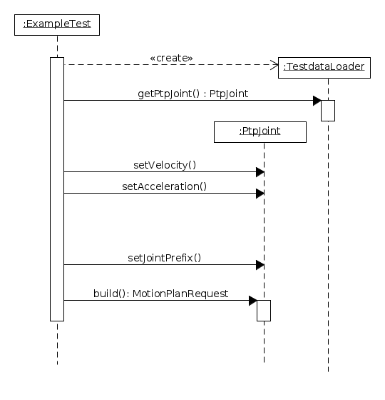
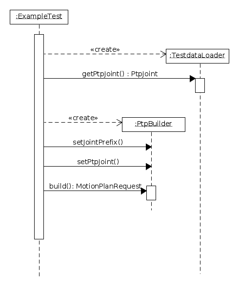
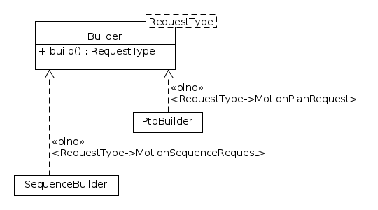

# Testdatenprovider
- Sind kartesische Positionen zu speichern, so ist die kartesische Position und
 der dazugehörige Seed zu speichern.
- Positionsangaben mithilfe von Achswerten sind gegenüber den kartesischen
Positionsangaben zu bevorzugen.
- Werden weitere Kennwerte benötigt so sind diese, insofern möglich,
über Hilfsfunktionen zu berechnen. In anderen Worten, es sollen so
wenig wie möglich Extrawerte abgespeichert werden.
- Die Orientierung kann je nach Anwendungfall in Euler- oder
Quaternion-Darstellung gespeichert werden. Ist beides möglich so ist die Euler-Darstellung zu bevorzugen, da sie leichter zu interpretieren ist.
- In Zukunft sollen neue Testdaten (Positionen, etc.) so gewählt werden, dass
sie auf allen bzw. möglichst vielen Testebenen genutzt werden können. Die neu
abgelegten Testdaten sollen dem Team kommuniziert werden (z.B. im Daily) um
nochmal im Team über die Güte der neuen Daten diskutieren zu können.

# Refactoring TestDataProvider
## Builder free variant

### Advantage
- No Builder or Director classes
- Transformation to request directly via Ptp-Class function call

### Disadvantages
- Ptp class contains information only needed for request building (like joint_prefix)
- "pure" data class Ptp has to change when request building changes or new conversion function are needed

## Builder variant

### Advantage
- Ptp pure data class: Data storage and possible transformations separated
- Transformation related information like "joint_prefix" stored in Builder

### Disadvantages
- Builder needed

## Class diagrams

### Robot configurations

### Robot configurations

### Builder

