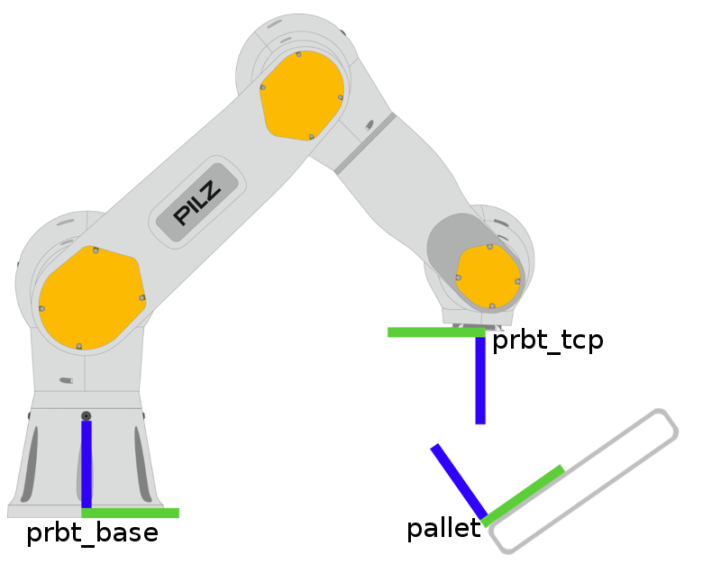
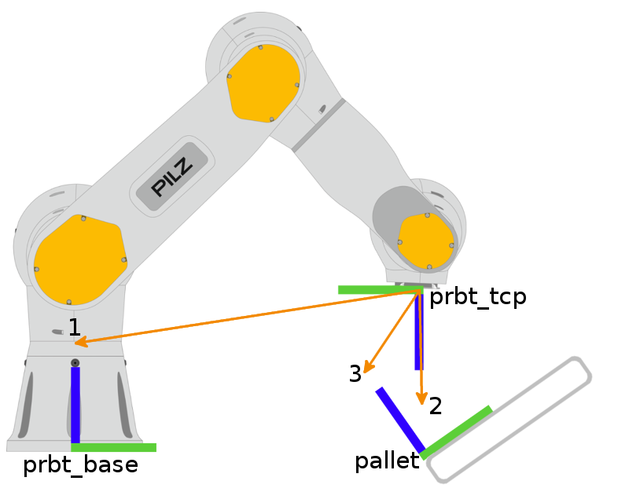

The pilz_robot_programming package provides the user with an easy to use API to move a MoveIt! enabled robot.
It's target is to execute standard industrial robot commands like :py:class:`.Ptp`, :py:class:`.Lin` and
:py:class:`.Circ` using the ``pilz::CommandPlanner`` plugin for MoveIt!. It also provides the user with the possibility
to execute command sequences (called :py:class:`.Sequence`). On top of that, the robot movement can be paused, resumed and
stopped.

All examples are given for a PRBT robot but the API is general enough to be used with any robot that
has a MoveIt! configuration, it merely requires the availability of the service ``/get_speed_override``
for obtaining the speed override of the robot system.

.. _here: https://github.com/PilzDE/pilz_robots/tree/melodic-devel/prbt_hardware_support

The robot API has some similarity to the ``moveit_commander`` package but differs in its specialization for
classical industrial robot commands to be executed by the ``pilz_command_planner`` MoveIt! plugin. The
robot API connects to MoveIt! using the standard ``move_group`` action interface and the custom ``sequence_move_group``
action, that the sequence capability implements.

See the package ``pilz_trajectory_generation`` for more details about the parameters for industrial trajectory
generation.

A simple demo program
=====================
To run the demo program it is first necessary to startup the simulated or the real robot.
Afterwards, you can execute the demo program by typing:

.. code-block:: none

    $ rosrun pilz_robot_programming demo_program.py

The code ``demo_program.py``
----------------------------

.. literalinclude:: ../examples/demo_program.py

The code explained
------------------
In this section parts of the demo program are explained to give a better understanding how the robot API is used.

:note: The chosen code snippets are not necessarily in order.

Robot creation
^^^^^^^^^^^^^^
.. code-block:: python

    from pilz_robot_programming import *

At first we import the robot API.

.. code-block:: python

    rospy.init_node('robot_program_node')

This code snippet initializes ROS.

.. code-block:: python

    r = Robot(__REQUIRED_API_VERSION__)

Here the robot object is created, which, subsequently, is used to move the robot.

The API version argument ensures, that the correct API version is used. This makes sure, that the
robot behaves as expected/intended. In case the versions do not match, an exception is thrown.

:note:
    For the API version check only the major version number is relevant.

:note:
    In general the speed of all motions depends on the operation mode of the robot system.
    For more information see prbt_hardware_support_.

.. _prbt_hardware_support: https://github.com/PilzDE/pilz_robots/tree/melodic-devel/prbt_hardware_support

Move
^^^^
.. code-block:: python

    r.move(Ptp(goal=[0, 0.5, 0.5, 0, 0, 0]))

.. code-block:: python

    r.move(Lin(goal=Pose(position=Point(0.2, 0, 0.8))))

.. code-block:: python

    r.move(Circ(goal=Pose(position=Point(0.2, 0.2, 0.8)), center=Point(0.3, 0.1, 0.8)))

The :py:meth:`.move` function is the most important part of the robot API. With the help of the :py:meth:`.move`
function the user can execute the different robot motion commands, like shown for :py:class:`.Ptp`, :py:class:`.Lin`
and :py:class:`.Circ`.

By default cartesian goals are interpreted as poses of the tool center point (TCP) link.
The transformation between the TCP link and the last robot link can be adjusted through the ``tcp_offset_xyz`` and
``tcp_offset_rpy`` parameters in ``prbt.xacro``.

Move failure
^^^^^^^^^^^^
.. code-block:: python

    try:
        r.move(Ptp(goal=[0, 10.0, 0, 0, 0, 0]))
    except RobotMoveFailed:
        rospy.loginfo("Ptp command did fail as expected.")

In case a robot motion command fails during the execution, the :py:meth:`.move` function throws
an :py:class:`.RobotMoveFailed` exception which can be caught using standard python mechanisms.

The goal: Joint vs. Cartesian space
^^^^^^^^^^^^^^^^^^^^^^^^^^^^^^^^^^^
.. code-block:: python

    r.move(Ptp(goal=[0, 0.5, 0.5, 0, 0, 0]))

.. code-block:: python

    r.move(Lin(goal=Pose(position=Point(-0.2, -0.2, 0.6), orientation=from_euler(0.1, 0, 0))))

The goal pose for :py:class:`.Ptp` and :py:class:`.Lin` commands can be stated either in joint space or
in Cartesian space.

.. code-block:: python

    r.move(Circ(goal=Pose(position=Point(0.2, 0.2, 0.8)), center=Point(0.3, 0.1, 0.8)))

The goal and the auxiliary pose of :py:class:`.Circ` commands have to be stated in Cartesian space.

Relative commands
^^^^^^^^^^^^^^^^^
.. code-block:: python

     r.move(Ptp(goal=[0.1, 0, 0, 0, 0, 0], relative=True))

.. code-block:: python

    r.move(Lin(goal=Pose(position=Point(0, -0.2, -0.2)), relative=True))

:py:class:`.Ptp` and :py:class:`.Lin` commands can also be stated as relative commands indicated by the argument
``relative=True``. Relative commands state the goal as offset relative to the current robot position.
As long as no custom reference frame is set, the offset has to be stated with regard to the base coordinate system.
The orientation is added as offset to the euler-angles.

Custom Reference Frame
^^^^^^^^^^^^^^^^^^^^^^
.. code-block:: python

    r.move(Ptp(goal=PoseStamped(header=Header(frame_id="prbt_tcp"),
                                pose=Pose(position=Point(0, 0, 0.1)))))

.. code-block:: python

    r.move(Ptp(goal=Pose(position=Point(0, -0.1, 0)), reference_frame="prbt_link_3", relative=True))

For all three move classes :py:class:`.Ptp`, :py:class:`.Lin` and :py:class:`.Circ` you can define a custom reference
frame.
Passing a PoseStamped with the Header set to any valid tf2 ``frame_id`` is supported besides an extra argument
``reference_frame``. The goal passed is interpreted relative to the given coordinate frame instead of the default
system ``prbt_base``.

The custom reference frame argument (``reference_frame="target_frame"``) has to be a valid tf frame id and can be paired with the relative command.
When paired with relative flag, the goal will be applied to the current robot pose in this custom reference frame.

:note:
  Further information on tf is available on http://wiki.ros.org/tf (e.g. on how to create custom frames: section 6.3).

More Detailed Explanation
~~~~~~~~~~~~~~~~~~~~~~~~~

Let's assume we have three coordinate systems in our application. (displayed with a green and blue line)

* ``prbt_base`` is the default coordinate system. It was used in the previous sections.
* The ``prbt_tcp`` frame is the current position of the gripper.
* The third frame ``pallet`` is supposed to be an edge of an product tray, that we placed somewhere in the robot environment.

We then have three possible frames, we can choose to execute our goal in.

In the image above we displayed three move commands.
All three commands move the robot to position x = y = 0 and z = 0.2, but use the different frames as reference.

1. goal=Pose(position=Point(0, 0, 0.2))) or goal=Pose(position=Point(0, 0, 0.2)), reference_frame="prbt_base")
2. goal=Pose(position=Point(0, 0, 0.2)), reference_frame="prbt_tcp")
3. goal=Pose(position=Point(0, 0, 0.2)), reference_frame="pallet")

When adding the relative flag additionally, the goal will be added to the current tcp pose using the chosen frame.
This results in the tcp moving in different directions depending on which frame we used.

In this case we just added the relative flag to the previous goals.

1. goal=position=Point(0, 0, 0.2)), relative=True)
2. goal=position=Point(0, 0, 0.2)), reference_frame="prbt_tcp", relative=True)
3. goal=position=Point(0, 0, 0.2)), reference_frame="pallet", relative=True)

As can be seen above, the relative movement used the z axis of the choosen reference frame,
which resulted in different movements of the tcp, except for the tcp frame itself.
In the case of the tcp frame, relative and absolut movement is the same.

Example of Usage
~~~~~~~~~~~~~~~~
To display how and when to use this options we take a look on a small example.

  .. image:: doc/pick_place.png
      :height: 200
      :width: 300

This image is supposed to display a series of pick operations on a rigid object.
The products are placed on a product tray, thus having a fixed position relative to the pallet reference frame.

To get the robot in a position similar to the robot in this image we could use a move command with a custom reference_frame.

.. code-block:: python

    r.move(Ptp(goal=[0.1, -0.05, 0.2, 2.3561, 0, 0], reference_frame="pallet"))

This would result in a scene, that looks somewhat like the image above.
(The Rotation around the x axis is necessary to reach the current tcp rotation)

The next commands in the sequence will be:

1. close in to grab the object
2. move straight up to lift it
3. move to the next object

For the first task we can easily use the tcp ref, since its rotation already fits our goal.

.. code-block:: python

    r.move(Ptp(goal=position=Point(0, 0, 0.1)), reference_frame="prbt_tcp"))

The second command - lifting the object - is best achieved by using an relative movement to the pallet frame.
(We could as well use the global system in this case, but when the tray is tilted,
like in the images above it could be problematic to do so.)

.. code-block:: python

    r.move(Ptp(goal=position=Point(0, 0, 0.1)), relative= True, reference_frame="pallet"))

For the third move we again should use the relative move in the "pallet" reference frame.

.. code-block:: python

    r.move(Ptp(goal=position=Point(0, -0.1, 0)), relative= True, reference_frame="pallet"))

In case we want to place the product somewhere else, previous to moving to the next object,
we would instead use the absolute command in the pallet reference frame
or add new frames for each object on the tray and do all operations for each object relative its frame.

Sequence
^^^^^^^^

.. code-block:: python

    # Repeat the previous steps with a sequence command
    sequence = Sequence()
    sequence.append(Lin(goal=Pose(position=Point(0.2, 0, 0.8)), vel_scale=0.1, acc_scale=0.1))
    sequence.append(Circ(goal=Pose(position=Point(0.2, -0.2, 0.8)), center=Point(0.1, -0.1, 0.8), acc_scale=0.4))
    sequence.append(Ptp(goal=pose_after_relative, vel_scale=0.2))

    r.move(sequence)

To concatenate multiple trajectories and plan the trajectory at once, you can
use the :py:class:`.Sequence` command.

:note:
    In case the planning of a command in a :py:class:`.Sequence` fails, non of the commands
    in the :py:class:`.Sequence` are executed.

As an optional argument, a blending radius can be given to the :py:class:`.Sequence` command. The blending radius
states how much the robot trajectory can deviate from the original trajectory (trajectory without blending) to
blend the robot motion from one trajectory to the next. Setting the blending radius to zero corresponds to a :py:class:`.Sequence`
without blending like above. If a blending radius greaten than zero is given,
the robot will move from one trajectory to the next without stopping.

.. code-block:: python

    # Blend sequence
    blend_sequence = Sequence()
    blend_sequence.append(Lin(goal=Pose(position=Point(0.2, 0, 0.6))), blend_radius=0.01)
    blend_sequence.append(Lin(goal=Pose(position=Point(0.2, 0, 0.7))))

    r.move(blend_sequence)

:note:
    The last command of the sequence has to have zero blending radius which can be achieved by omitting
    the blend radius argument.

:note: The robot always stops between gripper and non-gripper commands.

:note: Gripper commands cannot be blended together.

Gripper
^^^^^^^

If the launch file is started with the real robot and the argument ``gripper:=pg70``, the gripper can
be opened or closed via:

.. code-block:: python

    r.move(Gripper(gripper_pos=0.02))

Set the ``gripper_pos`` argument to a distance in meters. Both gripper fingers of the
PG+70 gripper move by the same distance so the gripper is twice as open as specified.

You can also append a :py:class:`.Gripper` to a :py:class:`.Sequence`.

Current TCP pose and current joint values
^^^^^^^^^^^^^^^^^^^^^^^^^^^^^^^^^^^^^^^^^
.. code-block:: python

     start_joint_values = r.get_current_joint_states()

.. code-block:: python

    pose_after_relative = r.get_current_pose()

The API provides functions which allow the user to determine the current joint values of the robot and the
current TCP pose. The return value of both functions can directly be used to create new motion commands:

.. code-block:: python

    r.move(Ptp(goal=pose_after_relative, vel_scale=0.2))

.. code-block:: python

    r.move(Ptp(goal=start_joint_values))

The function ``get_current_pose`` can also return the current pose in respect to another frame.
To do this, set the ``base`` argument, to the corresponding reference frame.

.. code-block:: python

    tcp_pose_in_tf = r.get_current_pose(base="target_frame")

Brake Test
^^^^^^^^^^
The method :py:meth:`.is_brake_test_required` will check whether the robot needs to perform a brake test.
So place it in your program somewhere such that it is checked repeatedly.
The method :py:meth:`.execute_brake_test` executes the brake test and throws an exception, should it fail.

.. code-block:: python

    if r.is_brake_test_required():
        try:
            r.execute_brake_test()
        except RobotBrakeTestException as e:
            rospy.logerr(e)
        except rospy.ROSException as e:
            rospy.logerr("failed to call the service")

Move control orders
-------------------
The user can make service calls in order to control the movement of the robot.
A running program can be paused by typing

.. code-block:: console

    rosservice call pause_movement

If the robot is currently moving, it is stopped. A paused execution can be resumed via

.. code-block:: console

    rosservice call resume_movement

This also resumes the last robot movement from where it stopped. A resume order without
preceding pause has no effects. There also exists the possibility to abort the program using

.. code-block:: console

    rosservice call stop_movement

Multithreading
^^^^^^^^^^^^^^
When :py:meth:`.move` is running in a separate thread, the move control orders can be issued
directly via the following methods of the robot object:

.. code-block:: python

    r.pause()

.. code-block:: python

    r.resume()

.. code-block:: python

    r.stop()

In this case :py:meth:`.stop` only ends the move-thread.
