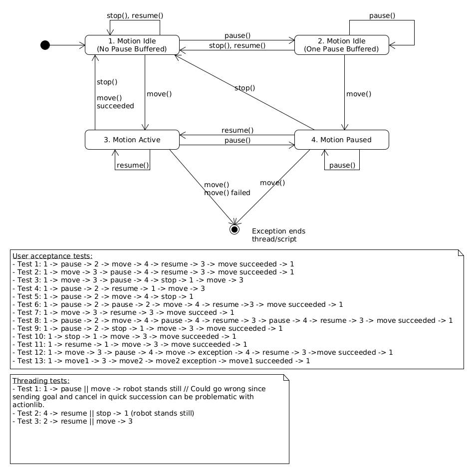

# Architecture

Class diagram of Python-API:

# API state diagram
The following diagram shows the different states in which the API can be from
a users point of view. The actual implementation is based on the more simpler
move-control-request scheme displayed below.

# Move control request state machine
The following diagram illustrates the requests which can be given to the
move function and the connection between them.
The move control request "tells" the thread executing the move function:
* to wait for resume,
* to end waiting for resume or
* to perform normally.

# Brake test
The component architecture that is required to execute brake tests is mainly implemented in [prbt_hardware_support](https://github.com/PilzDE/pilz_robots/tree/melodic-devel/prbt_hardware_support). A [diagram](https://github.com/PilzDE/pilz_robots/tree/melodic-devel/prbt_hardware_support/doc/diag_comp_overall_architecture.png) illustrates the components and how they are called by the Python-API.
