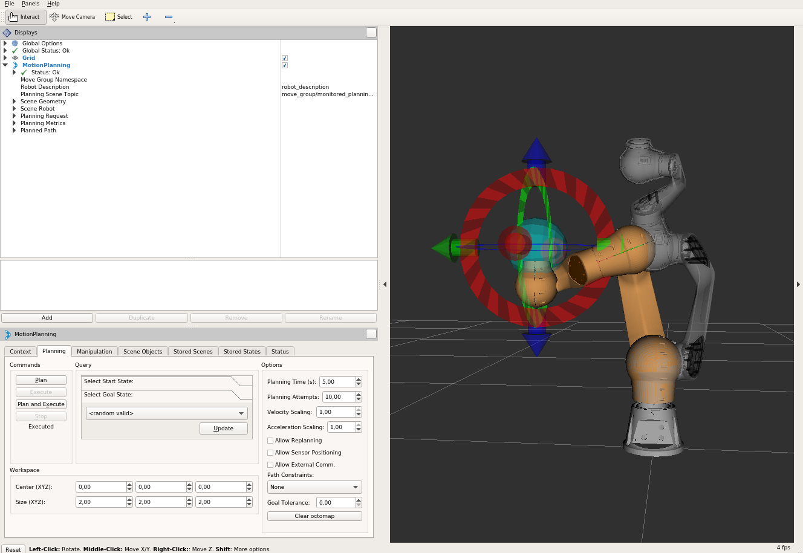

# Overview
This package provides a trajectory generator to plan standard robot motions like PTP, LIN, CIRC
in the form of a MoveIt! PlannerManager plugin.

# MoveIt!
MoveIt! is state of the art software for mobile manipulation, incorporating the latest advances in motion planning,
manipulation, 3D perception, kinematics, control and navigation. For detailed information,
please refer to the [MoveIt! website](http://moveit.ros.org/).

# ROS API
## User Interface MoveGroup
This package implements the `planning_interface::PlannerManager` interface of MoveIt!. By loading the corresponding
planning pipeline (`command_planner_planning_pipeline.launch.xml` in `prbt_moveit_config` package), the trajectory
generation functionalities can be accessed through the user interface (c++, python or rviz) provided by
the `move_group` node, e.g. `/plan_kinematics_path` service and `/move_group` action. For detailed tutorials please
refer to [MoveIt! Tutorials](http://docs.ros.org/indigo/api/moveit_tutorials/html/index.html).

## Joint Limits
For all commands the planner needs to know the limitations of each robot joint.
The limits used are calculated from the limits set in the urdf as well as the limits set on the parameter server
(usually put there by loading a *.yaml file such as prbt_moveit_config/config/joint_limits.yaml).

Note that while setting position limits and velocity limits is possible in both the urdf and the parameter server
setting acceleration limits is only possible via the parameter server. In extension to the common `has_acceleration` and
`max_acceleration` parameter we added the ability to also set `has_deceleration` and `max_deceleration`(<0!).

The limits are merged under the premise that the limits from the parameter server must be stricter or at least equal
to the parameters set in the urdf.

Currently the calculated trajectory will respect the limits by using the strictest combination of all limits as a common
limit for all joints.

## Cartesian Limits
For cartesian trajectory generation (LIN/CIRC) the planner needs an information about the maximum speed in 3D cartesian
space. Namely translational/rotational velocity/acceleration/deceleration need to be set on the parameter server like this:

``` yaml
cartesian_limits:
  max_trans_vel: 1
  max_trans_acc: 2.25
  max_trans_dec: -5
  max_rot_vel: 1.57
```

The planners assume the same acceleration ratio for translational and rotational trapezoidal shapes.
So the rotational acceleration is calculated as max_trans_acc / max_trans_vel * max_rot_vel (and for deceleration accordingly).

## Planning Interface
As defined by the user interface of MoveIt!, this package uses `moveit_msgs::MotionPlanRequest` and
`moveit_msgs::MotionPlanResponse` as input and output for motion planning. These message types are designed to be
comprehensive and general. The parameters needed by specific planning algorithm are explained below in detail.

For a general introduction how to fill a `MotionPlanRequest` see the
[Move Group Interface Tutorial](http://docs.ros.org/kinetic/api/moveit_tutorials/html/doc/pr2_tutorials/planning/src/doc/move_group_interface_tutorial.html).

The planner is able to handle all the different commands. Just put "PTP", "LIN" or "CIRC" as planner_id in
the motion request.

## The PTP motion command
This planner generates full synchronized point to point trajectories with trapezoid joint velocity profile. All joints
are assumed to have the same maximal joint velocity/acceleration/deceleration limits. If not, the strictest limits are
adopted. The axis with the longest time to reach the goal is selected as the lead axis.
Other axes are accelerated so that they share the same acceleration/constant velocity/deceleration phases
as the lead axis.


### Input parameters in `moveit_msgs::MotionPlanRequest`
 - `planner_id`: PTP
 - `group_name`: name of the planning group
 - `max_velocity_scaling_factor`: scaling factor of maximal joint velocity
 - `max_acceleration_scaling_factor`: scaling factor of maximal joint acceleration/deceleration
 - `start_state/joint_state/(name, position and velocity`: joint name/position/velocity(optional) of the start state.
 - `goal_constraints` (goal can be given in joint space or Cartesian space)
    - for goal in joint space
        - `goal_constraints/joint_constraints/joint_name`: goal joint name
        - `goal_constraints/joint_constraints/position`: goal joint position
    - for goal in Cartesian space
        - `goal_constraints/position_constraints/header/frame_id`: frame this data is associated with
        - `goal_constraints/position_constraints/link_name`: target link name
        - `goal_constraints/position_constraints/constraint_region`: bounding volume of the target point
        - `goal_constraints/position_constraints/target_point_offset`: offset (in the link frame) for the target point on
        the target link (optional)
 - max_velocity_scaling_factor: rescale the maximal velocity
 - max_acceleration_scaling_factor: rescale the maximal acceleration/deceleration

### planning results in `moveit_msg::MotionPlanResponse`
 - `trajectory_start`: bypass the `start_state` in `moveit_msgs::MotionPlanRequest`
 - `trajectory/joint_trajectory/joint_names`: a list of the joint names of the generated joint trajectory
 - `trajectory/joint_trajectory/points/(positions,velocities,accelerations,time_from_start)`: a list of generated way
 points. Each point has positions/velocities/accelerations of all joints (same order as the joint names) and time from start.
 - `group_name`: name of the planning group
 - `error_code/val`: error code of the motion planning

## The LIN motion command
This planner generates linear Cartesian trajectory between goal and start poses. The planner uses the Cartesian limits to
generate a trapezoidal velocity profile in Cartesian space. The translational motion is a linear interpolation between
start and goal position vector. The rotational motion is quaternion slerp between start and goal orientation. The
translational and rotational motion is synchronized in time. This planner only accepts start state with zero velocity.
Planning result is a joint trajectory. The user needs to adapt the Cartesian velocity/acceleration scaling factor if
motion plan fails due to violation of joint space limits.

### Input parameters in `moveit_msgs::MotionPlanRequest`
 - `planner_id`: LIN
 - `group_name`: name of the planning group
 - `max_velocity_scaling_factor`: scaling factor of maximal Cartesian translational/rotational velocity
 - `max_acceleration_scaling_factor`: scaling factor of maximal Cartesian translational/rotational acceleration/deceleration
 - `start_state/joint_state/(name, position and velocity`: joint name/position of the start state.
 - `goal_constraints` (goal can be given in joint space or Cartesian space)
    - for goal in joint space
        - `goal_constraints/joint_constraints/joint_name`: goal joint name
        - `goal_constraints/joint_constraints/position`: goal joint position
    - for goal in Cartesian space
        - `goal_constraints/position_constraints/header/frame_id`: frame this data is associated with
        - `goal_constraints/position_constraints/link_name`: target link name
        - `goal_constraints/position_constraints/constraint_region`: bounding volume of the target point
        - `goal_constraints/position_constraints/target_point_offset`: offset (in the link frame) for the target point on
        the target link (optional)
 - max_velocity_scaling_factor: rescale the maximal velocity
 - max_acceleration_scaling_factor: rescale the maximal acceleration

### planning results in `moveit_msg::MotionPlanResponse`
 - `trajectory_start`: bypass the `start_state` in `moveit_msgs::MotionPlanRequest`
 - `trajectory/joint_trajectory/joint_names`: a list of the joint names of the generated joint trajectory
 - `trajectory/joint_trajectory/points/(positions,velocities,accelerations,time_from_start)`: a list of generated way
 points. Each point has positions/velocities/accelerations of all joints (same order as the joint names) and time from start.
 - `group_name`: name of the planning group
 - `error_code/val`: error code of the motion planning


## The CIRC motion command
This planner generates an circular arc trajectory in Cartesian space between goal and start poses. The center point of
the circle or a interim point on the arc needs to be given as path constraint. The planner always generates the shorter
arc between start and goal poses and cannot generate half circle in case of given center point. The planner cannot generate
full circle. The Cartesian limits, namely translational/rotational velocity/acceleration/deceleration need to be set
and the planner uses these limits to generate a trapezoid velocity profile in Cartesian space. The rotational motion is
quaternion slerp between start and goal orientation. The translational and rotational motion is synchronized in time.
This planner only accepts start state with zero velocity. Planning result is a joint trajectory. The user needs to adapt
the Cartesian velocity/acceleration scaling factor if motion plan fails due to violation of joint limits.

### Input parameters in `moveit_msgs::MotionPlanRequest`
 - `planner_id`: CIRC
 - `group_name`: name of the planning group
 - `max_velocity_scaling_factor`: scaling factor of maximal Cartesian translational/rotational velocity
 - `max_acceleration_scaling_factor`: scaling factor of maximal Cartesian translational/rotational acceleration/deceleration
 - `start_state/joint_state/(name, position and velocity`: joint name/position of the start state.
 - `goal_constraints` (goal can be given in joint space or Cartesian space)
    - for goal in joint space
        - `goal_constraints/joint_constraints/joint_name`: goal joint name
        - `goal_constraints/joint_constraints/position`: goal joint position
    - for goal in Cartesian space
        - `goal_constraints/position_constraints/header/frame_id`: frame this data is associated with
        - `goal_constraints/position_constraints/link_name`: target link name
        - `goal_constraints/position_constraints/constraint_region`: bounding volume of the target point
        - `goal_constraints/position_constraints/target_point_offset`: offset (in the link frame) for the target point on
        the target link (optional)
 - `path_constraints` (position of the interim/center point)
    - `path_constraints/name`: interim or center
    - `path_constraints/position_constraints/constraint_region/primitive_poses/point`: position of the point
 - max_velocity_scaling_factor: rescale the maximal velocity
 - max_acceleration_scaling_factor: rescale the maximal acceleration

### planning results in `moveit_msg::MotionPlanResponse`
 - `trajectory_start`: bypass the `start_state` in `moveit_msgs::MotionPlanRequest`
 - `trajectory/joint_trajectory/joint_names`: a list of the joint names of the generated joint trajectory
 - `trajectory/joint_trajectory/points/(positions,velocities,accelerations,time_from_start)`: a list of generated way
 points. Each point has positions/velocities/accelerations of all joints (same order as the joint names) and time from start.
 - `group_name`: name of the planning group
 - `error_code/val`: error code of the motion planning

## Example
By running
```
roslaunch prbt_moveit_config demo.launch
```
the user can interact with the planner through rviz.



## Using the command planner
The *pilz::CommandPlanner* is provided as MoveIt! Motion Planning Pipeline and, therefore, can be used with all
other manipulators using MoveIt!. Loading the plugin requires the param `/move_group/planner_plugin` to be set to `pilz::CommandPlanner`
before the move_group nodes is startet.

To use the command planner cartesian limits have to be defined.
The limits are expected to be under the namespace `<robot_description>_planning`.  Where `<robot_description>` refers to the parameter under which the urdf is loaded.
E.g. if the urdf was loaded into `/robot_description` the cartesian limits have to be defined at `/robot_description_planning`.

An example showing the cartesian limits which have to be defined can be found
.
